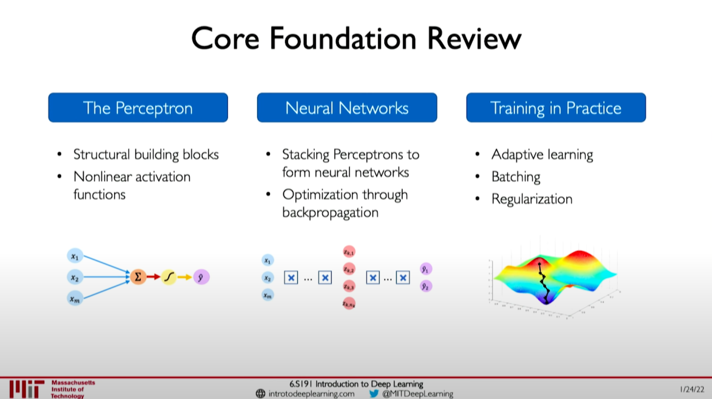
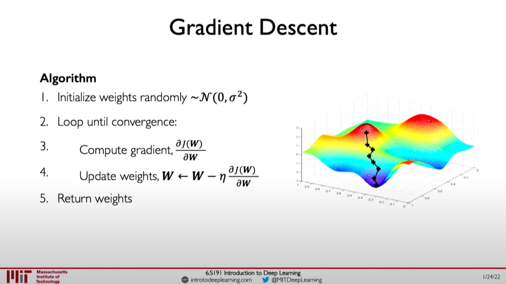

# Introduction to Deep Learning

## The Perceptron

- Funcdamental building blocks of nueral networks (a single neuron)
- Nonlinear activation functions
  - The purpose of activation functions is to introduce non-linearities into the network.

## Neural Networks

- Stacking Perceptrons to form neural networks
  - Because all inpouts are denely connected to all outputs, these layers are called Dense layers.
- Loss functions
  - The loss of our network measures the coset uncurred from incorrect predictions.
  - The empiricial loss measures the total loss over our entire dataset.
  - Cross entropy loss can be used with models that output a probability between 0 and 1.
  - Mean squared error loss can be used with models that output continious real numbers.
- Optimization through backpropagation
  - We want to find the network weights that achieve the lowest loss.

### Gradient Descent

#### Algorithm

- Initialize weights randomly $\sim N(0,\sigma^2)$
- Loop untill convergence:
  - Compute gradient, $\dfrac{\delta J(W)}{\delta W}$
  - Update weights, $W \leftarrow W - \eta\dfrac{\delta J(W)}{\delta W}$
- Return weights

## Training in Practice

- Adaptive learning
  - Small learning rate converges slowly and gets stuck in false local minima.
  - Large learning rates overshoot, become unstable anf diverge.
  - Stable Learning rates converge smoothly and avoid local minima.
  - Adaptive learning rates are no longer fixed and can be made larger or smaller dependingon factors like gradient, learning rate, size of particular weights etc.
- Batching
  - More accurate estimation of gradient.
    - Smoother convergence.
    - Allows for larger learning rates.
  - Mini-batches lead to fast training.
    - Can parallelize computation.
    - Achieve significant speed increases on GPUs
- Regularization
  - What: Technique that constrains our optimization problem to discourage complex models.
  - Why: Improve generalization of our model on unseen data.
  - Dropout
    - During training, randomly set activations to 0.
    - Typically 'drop' 50% of activations in layer.
    - Forces network to not reply on any 1 node.
  Early Stopping
    - Stop training before we have a chanve to overfit.

## Lecture Slides

[Introduction to Deep Learning](Introduction_to_Deep_Learning.pdf)
