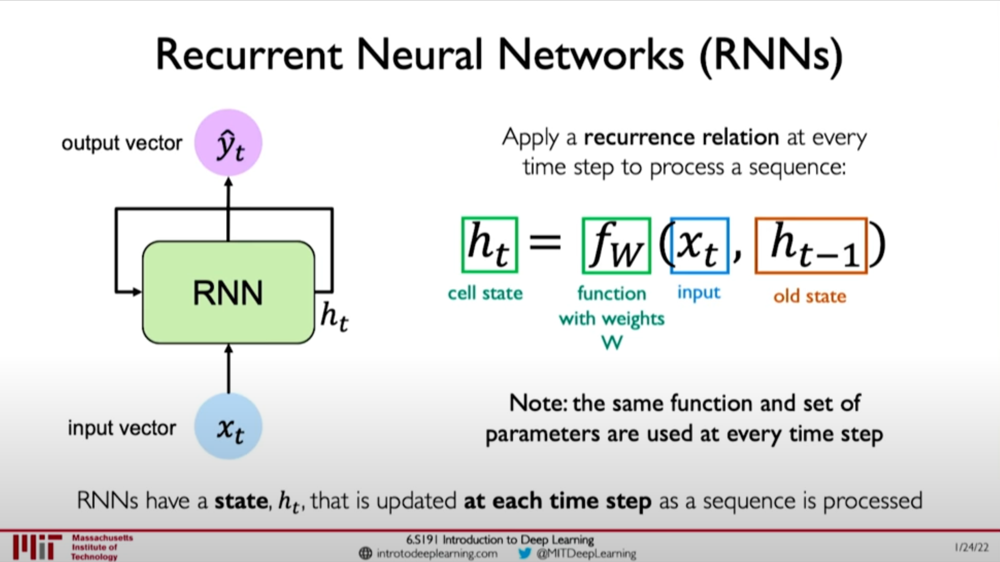
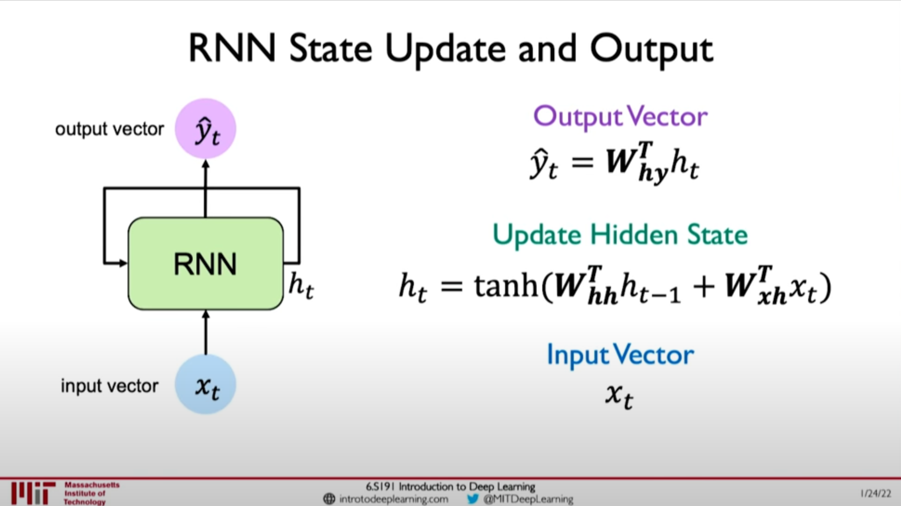
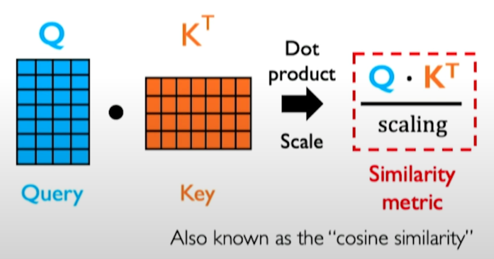

# Deep Sequence Modeling

## Recurrent Neural Networks (RNNs)

- RNNs have a state, $h_t$, that is updated at each time step as a sequence is processed.
- Apply a recurrence relation at every time step to process a sequence: $h_t= f_W(x_t, h_{t-1})$

### Algorithm

- Initialize the RNNs with initial hidden states, typically set to zeros.
- Iterate through the words in the input sentence.
  - Feed the current word and the previous hidden state.
  - Output the likely prediction for the next word and the update the hidden state for the next word.
- Token prediction is the prediction from the RNN after going through the iteration completely.

## Self-Attention

- Goal: Idetntify and attend to most important features in input.
  - Encode position information.
  - Extract query, key, value for search.
  - Compute attention weighting.
  - Extract features with high attention.
- These operations form a self-attention head that can plug into a larger network.
- Each head attends to a different part of input.
- Attention score: compute pairwaise similarity between each query and key.

## Summary

- RNNs are well suited for sequence modeling tasks.
- Model sequences via a recurrence relation.
- Training RNNs with back propogation through time.
- Models for music generation, classification, machine translation, and more.
- Self-attention to model sequences without recurrence.
