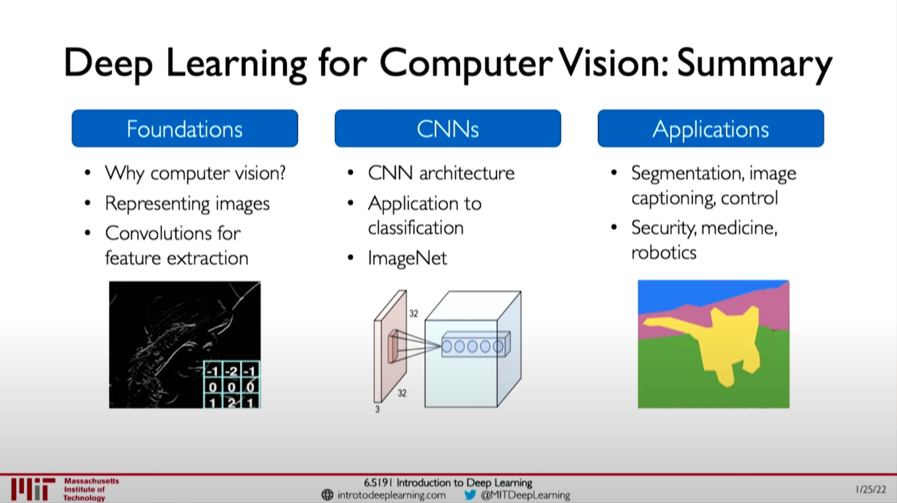

# Deep Computer Vision

## Tasks in Computer vision

- Regression and Quantiative analysis
  - Output variable takes continuous value.
- Recognition and Classification
  - Output variable takes class label.
  - Can produce probability pf belonging to a particular class.

## Convolutional Neural Networks (CNNs)

- Convolutional Neural Network
  - Apply filter to generate feautre maps.
- Non-Linearity
  - Often ReLU: pixel-by-pixel operation that replaces all negative values by zero. None-linear operation!
  - Apply after every convolution operation (i.e., after convolutional layers).
- Pooling
  - Downsampling operation on each feature map.
  - Primarily used to reduce the dimensionality, to make the model scalable.

## An Architecture for Many Applications

CNNs can extend to a wide number of applications just by changing the second half of the architechute. The first half focueses on feature detection. The second half can be modified for the different requirements.

- Classification
- Object detection
- Segementation
- Probabilistic control

