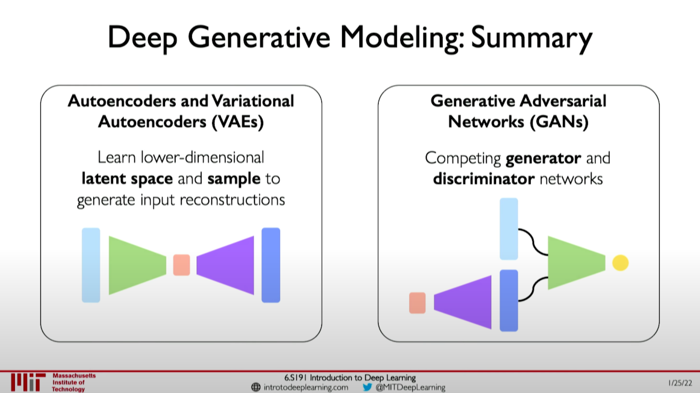

# Deep Generative Modeling

## Generative Modeling

- Goal: Take as input training samples from distribution and learn a model that represents that distribution.
  - Density Estimation
  - Sample Generation
- Debiasing
  - Capable of uncovering underlying features in a dataset.
    - Homogeneous skin color; pose
    - Device skin color; pose; illumination
  - Outlier Detection
    - Problem: How can we detect when we encounter new or rare?
    - Strategy: Leverage generative models, detect outliers in the distribution.
    - Use outliers during training to improve even more!

## Latent Variable Models

- Autoencoders and Variational Autoencoders (VAEs)
- Generative Adversarial Networks (GANs)

## Autoencoders

- Unsupervised approach for learning a lower-dimensional feature representation from unlabeled training data.
- "Encoder" learns mapping from the high dimensional input space to a lower-dimensional latent space.
- To learn this latent space, train the model to use these features to reconstruct the original data.
- Autoencoders for representation learning
  - Bottleneck hidden layer forces network to learn a compressed latent representation.
  - Reconstruction loss forces the latent representation to capture (or encode) as much "information" about the data as possible.
  - Autoencoding = Automatically encoding data; "Auto" = self-encoding

## Variational Autoencoders (VAEs)

- Variational autoencoders are a probabilistic twist on autoencoders!
- Sample from the ean and standard deviation to compute the latent sample.
- Compress representation of world to something we can use to learn.
- Reconstruction allows for unsupervised learning (no labels).
- Reparameterization trick to train end-to-end coding.
- Interpret hidden latent variables using perturbation.
- Genrating new examples.

### Priors on the latent distribution

- Common choice of prior - Normal Gaussian
  - Encourages encodings to distribute encodings evenly around the center of the latent space.
  - Penalize the network when it tried to "cheat" by clustering points in specific regions (i.e., by memorizing the data).
- Intuition on regularization and the Normal prior
  - Continuity - points that are close in latent space -> similar content after deoding
  - Completeness: sampling laten space -> "meaningful" content after decoding

## Generative Adversarial Networks (GANs)

- Idea: don't explicitly model density, and instead just sample to generate new instances.
- Problem: want to sample from complex distribution - can't do this directly!
- Solution: sample from something simple (e.g., noise), learn a transformation to the data distribution.
- GANs are a way to make a generative model by having two neural networks compete with each other.
- The generator turns noise into an imitation of the data to try to trick the discriminator.
- The discriminator tried to identify real data from fakes created by the generator.

.png)

