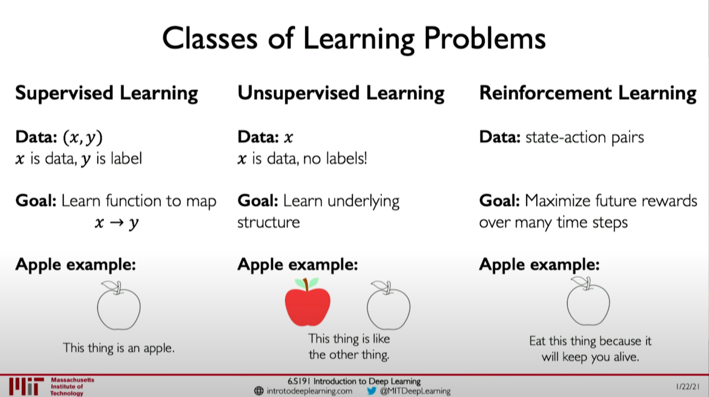
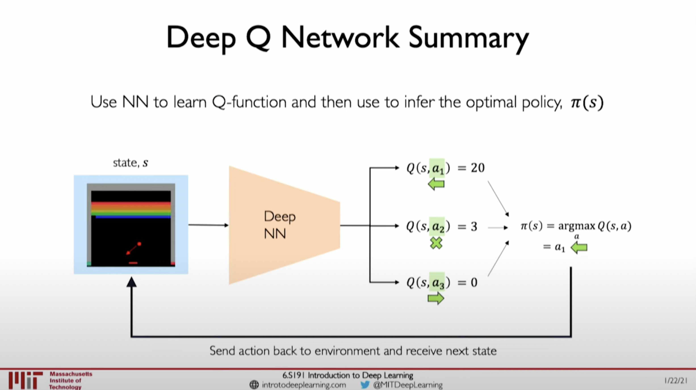
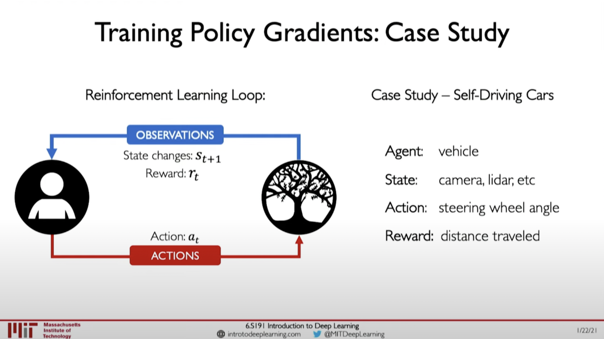
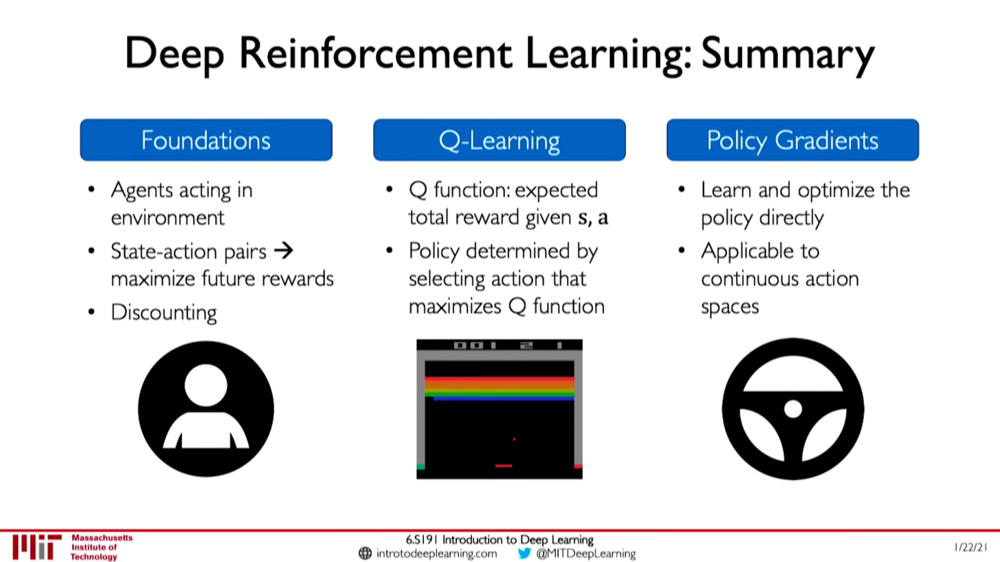

# Deep Reinforcement Learning

## Reinforcement Learning (RL)

- Action: a move the agent can make in the evironment.
- Action space A: the set of possible actions an agent can make in the environment.
- Obervations: of the environment after taking actions.
- State: a situation with the agent perceives.
- Reward: feedback that measures the success or failure of the agent's action.

## Deep Q Network

- Use NN to learn Q-function and then use that to infer optimal policy, $\pi(s)$.

### Downsides of Q-Learning

- Complexity
  - Can model scenarios where the action space is discrete and small.
  - Cannot handle continuous actuob spaces.
- Flexibility
  - Policy is deterministcally computed from the Q functionby maximizing the rewards -> cannot learn stochastic policies.

## Policy Gradient

- Directly optimize the policy, $\pi(s)$.

### Training Algorithm

- Initialize the agent.
- Run a policy until termination.
- Record all states, actions and, rewards.
- Decrease probability of actions that resulted in low reward.
- Incrrease probability of actions that result in high reward.
- $loss=(log-likelihood\ of\ action)(reward)=-logP(a_t|s_t)R_t$.
- Gradient descent update: $w'=w-\nabla loss=w+\nabla logP(a_t|s_t)R_t$.

